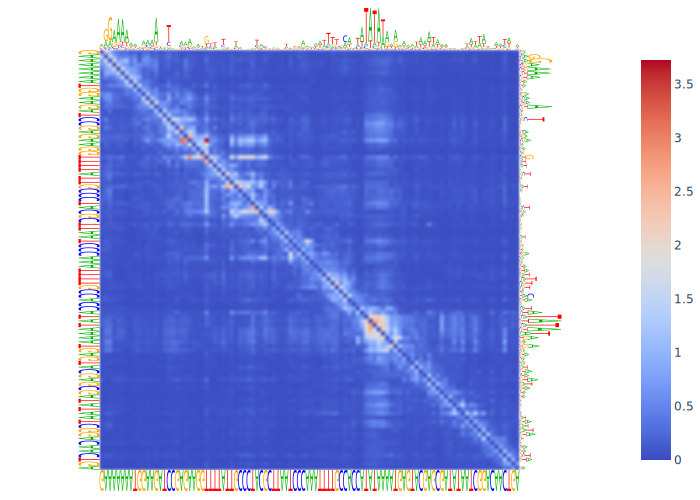

# dependency-map



## Plotting dependency maps
This library helps with plotting dependency maps for DNA language models ([original paper](https://github.com/gagneurlab/dependencies_DNALM)).
There are three different ways to use this library:

**Automatic:** Use `DependencyMap.compute_batched()`, which requires the sequence as a string, a tokenization function which also applies the masking and a forward function which performs inference for a batch.
See also `examples/specieslm.py` for an example on how to integrate this with a torch model.

**Guided:** Use `DependencyMap.make_dataset()` to create the dataset with masked and mutated sequences in the right order.
This dataset contains three groups of data concatenated together: the reference sequence, the sequence with masks at each position individually, and the sequence with all possible single nucleotide mutations.
For example, for the sequence ATG, this would be:
```
ATG,  # reference
XTG, AXG, ATX,  # masked
CTG, GTG, TTG,  # mutation at position 0
AAG, ACG, AGG,  # mutation at position 1
ATA, ATC, ATT   # mutation at position 2
```
Then, run this dataset through your model and give the logits back to `DependencyMap.from_logits()`.

**Manual:** Compute a dependency map and reconstruction yourself and call `DependencyMap()` directly.

In all three cases, you can the plot the dependency map with `DependencyMap.plot()`.
Note that this function's behavior can be customized with a number of arguments.

## Sequence logos
You can also use `SequenceLogo` to create sequence logo SVG files from various sources.
Please refer to the the many `SequenceLogo.from_*` functions for this purpose.
You can use `SequenceLogo.draw()` to create a drawsvg object which can render in notebooks or use `SequenceLogo.to_svg()` to render to SVG code.
When using `SequenceLogo.to_svg(data_url=True)`, you can even encode everything into one url object which can for example be passed to Plotly as an image.
